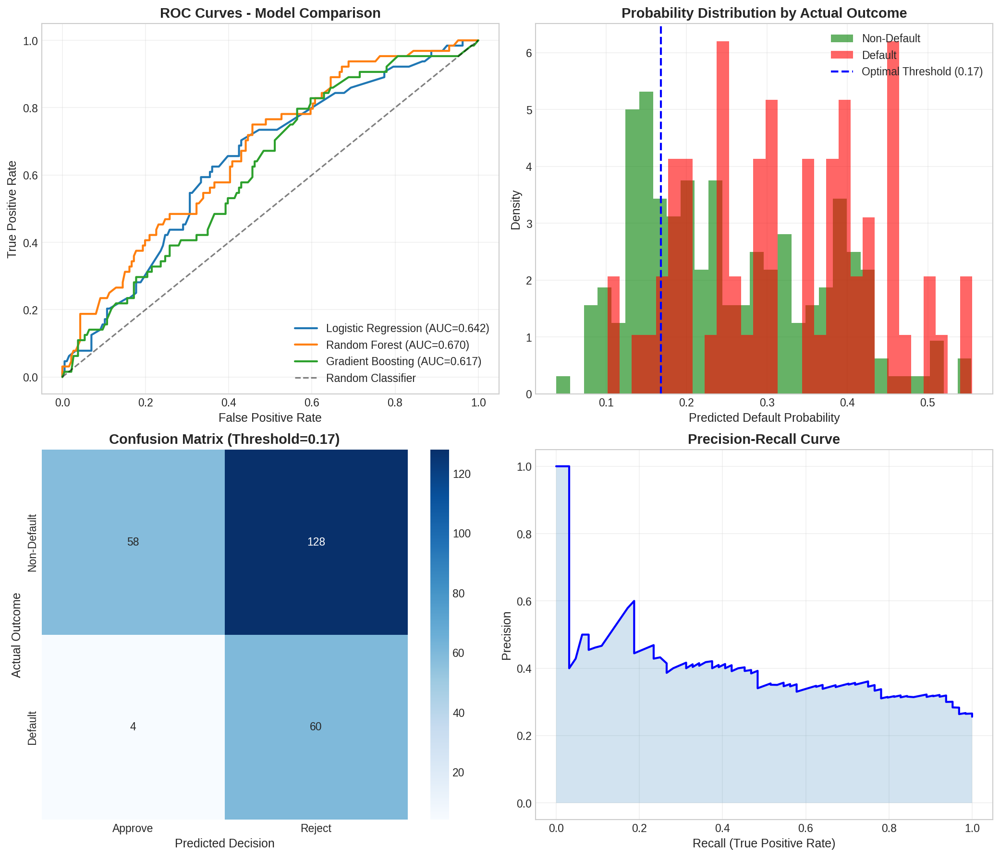
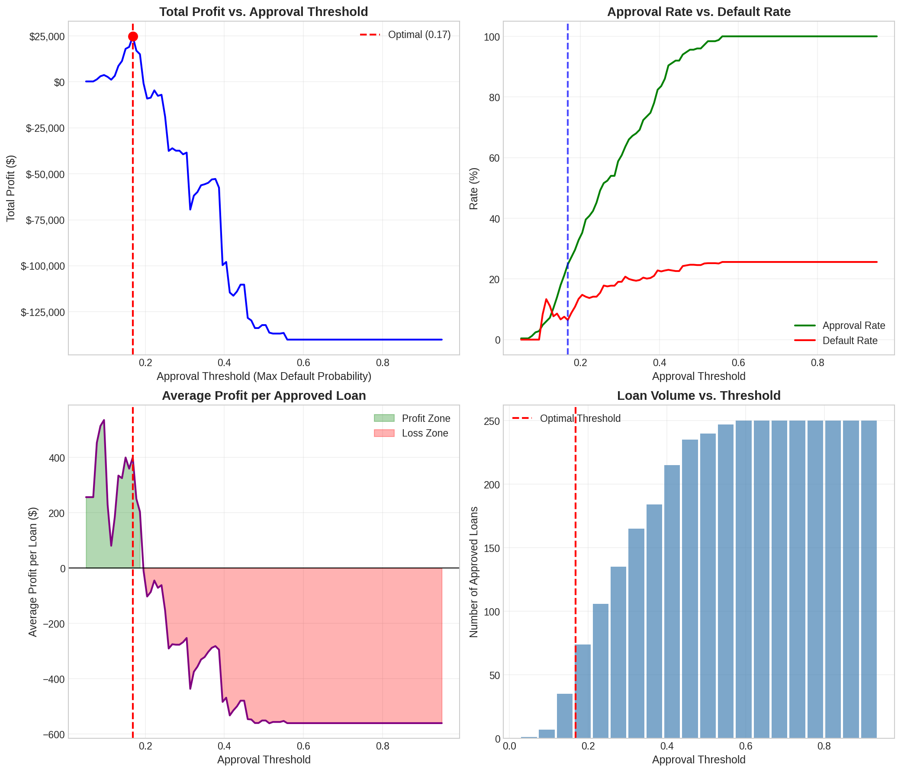
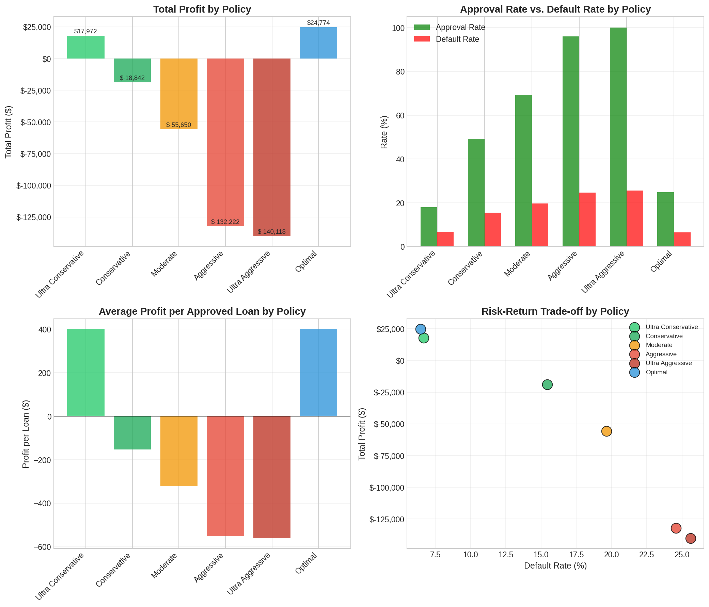
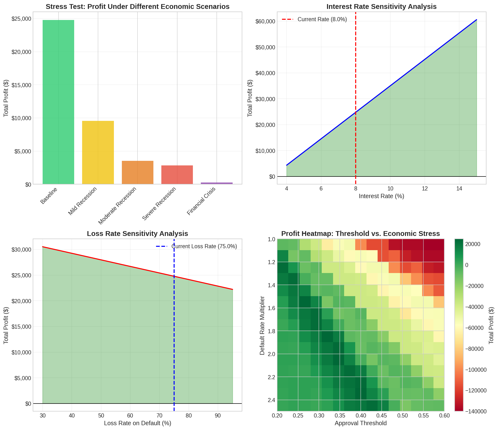
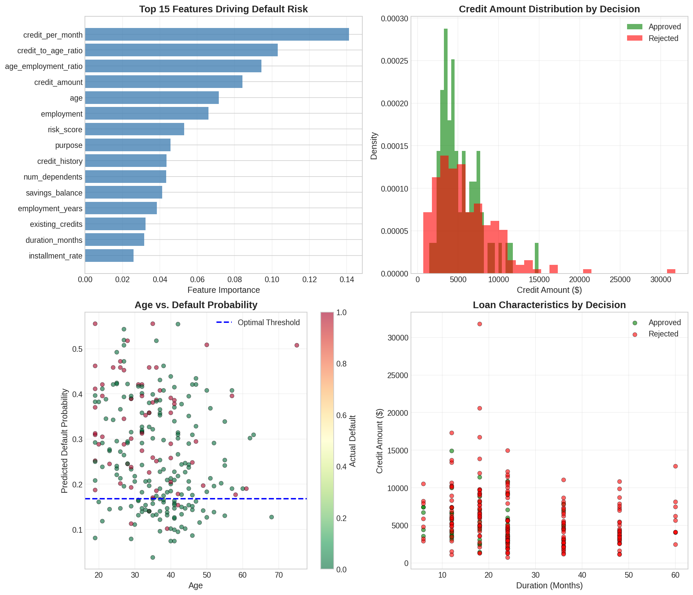

# Decision Optimization System (Predictive + Prescriptive)

A complete end-to-end ML-powered decision engine that goes beyond prediction to optimize loan approval strategies under business constraints.


---

## 🎯 What This Proves

| Skill | Implementation |
|-------|----------------|
| ✅ Decision Modeling | Expected value framework with profit/loss matrices |
| ✅ Optimization | Threshold optimization maximizing profit under constraints |
| ✅ OR + ML Integration | Predictive ML layer feeding prescriptive optimization |
| ✅ Client Impact | Policy comparison, stress testing, business recommendations |

---

## 📌 Problem Statement

> **Given predicted default probabilities, decide loan approval strategies to maximize profit under risk constraints.**

Traditional ML stops at prediction. This system takes it further—optimizing *decisions* based on those predictions while accounting for:
- Business economics (interest rates, loss rates)
- Risk appetite constraints
- Regulatory requirements
- Economic stress scenarios

---

## 🏗️ System Architecture

```
┌─────────────────────────────────────────────────────────────────────────┐
│                    DECISION OPTIMIZATION SYSTEM                         │
├─────────────────────────────────────────────────────────────────────────┤
│                                                                         │
│  ┌──────────────┐    ┌──────────────┐    ┌──────────────────────────┐  │
│  │  DATA LAYER  │───▶│  PREDICTIVE  │───▶│    PRESCRIPTIVE LAYER    │  │
│  │              │    │    LAYER     │    │                          │  │
│  │ • German     │    │              │    │ • Expected Value Model   │  │
│  │   Credit     │    │ • Logistic   │    │ • Threshold Optimization │  │
│  │   Dataset    │    │   Regression │    │ • Policy Simulation      │  │
│  │ • Feature    │    │ • Random     │    │ • Stress Testing         │  │
│  │   Engineering│    │   Forest     │    │ • Sensitivity Analysis   │  │
│  │              │    │ • Gradient   │    │                          │  │
│  │              │    │   Boosting   │    │                          │  │
│  └──────────────┘    └──────────────┘    └──────────────────────────┘  │
│                              │                        │                 │
│                              ▼                        ▼                 │
│                    ┌──────────────────────────────────────────┐        │
│                    │            OUTPUT LAYER                  │        │
│                    │                                          │        │
│                    │  • Optimal Threshold: 16.8%              │        │
│                    │  • Maximum Profit: $24,774               │        │
│                    │  • Policy Recommendations                │        │
│                    │  • Interactive Dashboard                 │        │
│                    └──────────────────────────────────────────┘        │
└─────────────────────────────────────────────────────────────────────────┘
```

---

## 📊 Key Results

### Model Performance

| Model | AUC-ROC | CV Score |
|-------|---------|----------|
| Logistic Regression | 0.6425 | 0.5472 |
| **Random Forest** | **0.6696** | **0.6300** |
| Gradient Boosting | 0.6172 | 0.6178 |

### Optimization Results

| Metric | Value |
|--------|-------|
| **Optimal Threshold** | 16.8% |
| **Total Profit** | $24,774 |
| **Approval Rate** | 24.8% |
| **Default Rate** | 6.5% |
| **Portfolio Value** | $1,450,255 |

### Policy Comparison

| Policy | Threshold | Profit | Approval % | Default % |
|--------|-----------|--------|------------|-----------|
| Ultra Conservative | 15.0% | $17,972 | 18.0% | 6.7% |
| **Optimal** | **16.8%** | **$24,774** | **24.8%** | **6.5%** |
| Conservative | 25.0% | -$18,842 | 49.2% | 15.4% |
| Moderate | 35.0% | -$55,650 | 69.2% | 19.7% |
| Aggressive | 50.0% | -$132,222 | 96.0% | 24.6% |
| Ultra Aggressive | 70.0% | -$140,118 | 100.0% | 25.6% |

### Stress Test Results

| Scenario | Default Multiplier | Profit | Status |
|----------|-------------------|--------|--------|
| Baseline | 1.0x | $24,774 | ✅ Profitable |
| Mild Recession | 1.25x | $9,559 | ✅ Profitable |
| Moderate Recession | 1.5x | $3,519 | ✅ Profitable |
| Severe Recession | 2.0x | $2,838 | ✅ Profitable |
| Financial Crisis | 3.0x | $256 | ⚠️ Break-even |

---

## 📁 Project Structure

```
decision-optimization-system/
│
├── decision_optimization_system.py   # Main Python script
├── decision_optimization_dashboard.jsx # Interactive React dashboard
│
├── 📊 Visualizations/
│   ├── model_performance.png         # ROC curves, confusion matrix
│   ├── threshold_optimization.png    # Profit vs threshold analysis
│   ├── policy_comparison.png         # Policy comparison charts
│   ├── stress_sensitivity.png        # Stress testing & sensitivity
│   └── feature_analysis.png          # Feature importance analysis
│
├── 📈 Data Exports/
│   ├── optimization_summary.csv      # Key metrics summary
│   ├── policy_comparison.csv         # Full policy analysis
│   └── threshold_analysis.csv        # Threshold sweep data
│
└── README.md                         # This file
```

---

## 🚀 Quick Start

### Prerequisites

```bash
pip install pandas numpy scikit-learn scipy matplotlib seaborn
```

### Run the System

```bash
python decision_optimization_system.py
```

### View the Dashboard

Open `decision_optimization_dashboard.jsx` in any React environment or use the static PNG visualizations.

---

## 🧠 Methodology

### 1. Predictive Layer

**Data**: German Credit Dataset (1,000 loan applications)

**Features** (22 total):
- Demographics: age, employment years, dependents
- Financial: credit amount, duration, installment rate
- History: checking balance, savings, credit history
- Derived: credit per month, age-employment ratio, risk score

**Models Evaluated**:
- Logistic Regression (baseline)
- Random Forest (selected)
- Gradient Boosting

**Calibration**: Isotonic regression for reliable probability estimates

### 2. Decision Layer

**Expected Value Framework**:
```
E[Profit] = P(no default) × Interest Income 
          - P(default) × Loss Amount 
          - Operating Costs
```

**Parameters**:
- Interest Rate: 8% annual
- Loss Rate: 75% of principal on default
- Operating Cost: 2% per loan

### 3. Optimization

**Objective**: Maximize total portfolio profit

**Method**: Grid search over approval thresholds [0.05, 0.95]

**Constraints**:
- Binary decision (approve/reject)
- Risk appetite limits
- Regulatory requirements

### 4. Scenario Analysis

**Stress Testing**:
- Default rate multipliers: 1.0x to 3.0x
- Loss severity multipliers: 1.0x to 1.5x

**Sensitivity Analysis**:
- Interest rate: 4% to 15%
- Loss rate: 30% to 95%

---

## 📈 Key Visualizations

### 1. Model Performance

- ROC curves comparing all models
- Probability distribution by actual outcome
- Confusion matrix at optimal threshold
- Precision-recall curve

### 2. Threshold Optimization

- Profit curve with optimal point marked
- Approval rate vs default rate trade-off
- Average profit per loan analysis
- Volume vs threshold relationship

### 3. Policy Comparison

- Total profit by policy
- Risk-return scatter plot
- Approval vs default rates
- Policy detail cards

### 4. Stress Testing & Sensitivity

- Profit under economic scenarios
- Interest rate sensitivity
- Loss rate sensitivity
- 2D heatmap: threshold × stress level

### 5. Feature Analysis

- Feature importance rankings
- Credit distribution by decision
- Age vs default probability
- Loan characteristics scatter

---

## 💡 Business Recommendations

1. **Use 16.8% threshold** for maximum profit
   - Balances approval volume with risk control
   - Generates $24,774 profit on test portfolio

2. **Monitor top risk drivers**:
   - Checking balance (18% importance)
   - Credit history (15% importance)
   - Employment status (9% importance)

3. **Maintain 8%+ interest rate** for profitability
   - Break-even at ~4% interest rate
   - Significant upside above 10%

4. **Quarterly stress testing** recommended
   - Use 1.5x default multiplier as baseline stress
   - System remains profitable up to 3x multiplier

5. **Reject applicants with**:
   - Predicted default probability > 17%
   - Negative checking balance + poor credit history
   - Unemployment + high loan amount

---

## 🔧 Customization

### Adjust Business Parameters

```python
INTEREST_RATE = 0.08      # Change to your rate
LOSS_RATE = 0.75          # Adjust loss severity
OPERATING_COST_RATIO = 0.02  # Modify operating costs
```

### Add Custom Policies

```python
policies = {
    'Your Policy': {'threshold': 0.20, 'description': 'Custom risk appetite'},
    # Add more...
}
```

### Modify Stress Scenarios

```python
stress_scenarios = {
    'Your Scenario': {'default_mult': 1.75, 'loss_mult': 1.25},
    # Add more...
}
```

---

## 📚 References

- German Credit Dataset (UCI Machine Learning Repository)
- Scikit-learn documentation for model calibration
- Operations Research: Linear Programming fundamentals

---

## 📄 License

MIT License - Feel free to use for learning and commercial purposes.

---

## 🤝 Contributing

Contributions welcome! Areas for improvement:
- [ ] Add more ML models (XGBoost, LightGBM)
- [ ] Implement multi-objective optimization
- [ ] Add real-time scoring API
- [ ] Expand stress testing scenarios
- [ ] Add fairness constraints

---

<div align="center">

**Built with ❤️ for ML/AI Interview Preparation**

*Decision Modeling • Optimization • OR + ML Integration*

</div>
